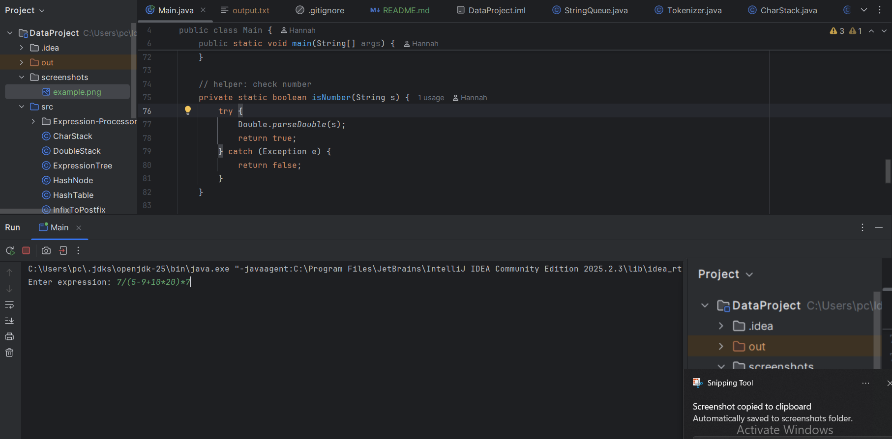
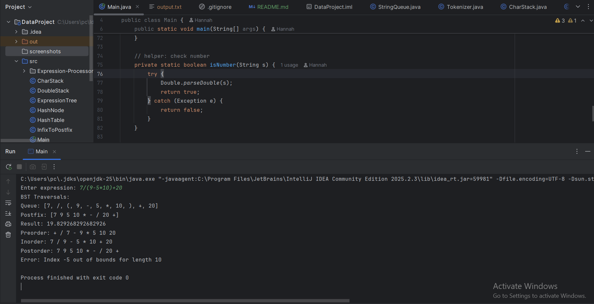
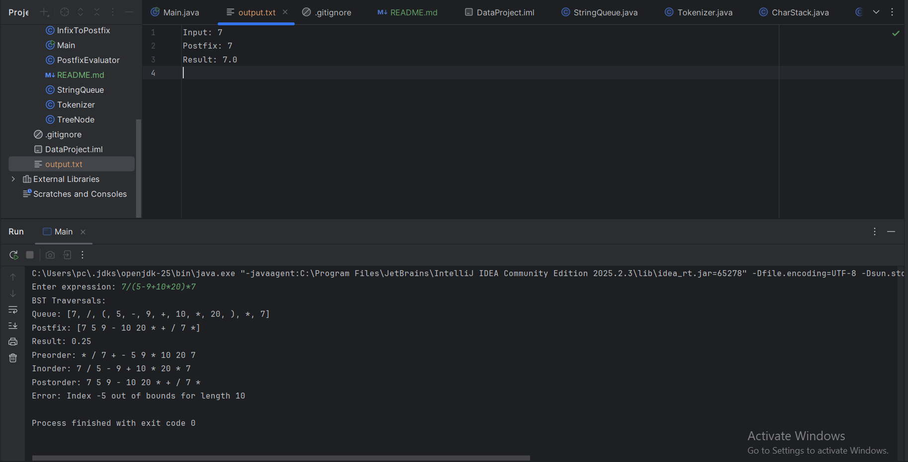

<div align="center">

# 🧮 Expression Processor (Java)

### ⚡ A Complete Data Structures & Algorithms Engine for Mathematical Expressions


</div>

---

## 🚀 Overview

A powerful Java console application that simulates how a real expression engine works.

It takes a mathematical expression and processes it step by step:

- Tokenization
- Infix → Postfix conversion (Shunting Yard Algorithm)
- Postfix evaluation
- Expression tree construction
- Tree traversal
- Hash table simulations
- File output generation

---

## 🧠 Core Features

✔ Multi-digit & decimal number support  
✔ Negative number handling  
✔ Expression parsing engine  
✔ Infix → Postfix conversion  
✔ Expression evaluation  
✔ Binary Expression Tree  
✔ Tree Traversals:
- Preorder
- Inorder
- Postorder

✔ Custom Data Structures:
- Stack (CharStack / DoubleStack)
- Queue (StringQueue)

✔ Hashing Techniques:
- Linear Probing
- Quadratic Probing
- Double Hashing
- Chaining

✔ File output support (`output.txt`)

---

## 📊 System Flow

Input Expression
↓
Tokenization
↓
Infix → Postfix
↓
Evaluation
↓
Expression Tree
↓
Traversals + Hashing
↓
Output Result

---

## 🧠 Concepts Used

- Stacks
- Queues
- Trees
- Recursion
- Hashing
- Parsing Algorithms
- OOP Design

---

## 📂 Project Structure

├── Main.java
├── Tokenizer.java
├── InfixToPostfix.java
├── PostfixEvaluator.java
├── ExpressionTree.java
├── TreeNode.java
├── CharStack.java
├── DoubleStack.java
├── StringQueue.java
├── HashTable.java


---

## ▶️ How to Run

```bash
git clone https://github.com/HannahElsayed/Expression-Processor-Java.git

## 📸 Screenshots  

### Input

### Output

### Output.txt


---
👩‍💻 Author

Hannah Elsayed